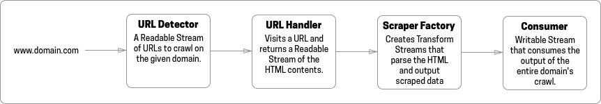
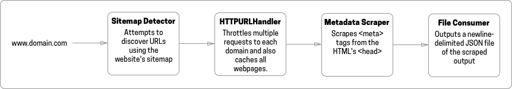

# Turbo Crawl
  The simple and fast crawling framework.

## Overview

Turbo Crawl is designed with the following principles:

- **Works out of the box -** The default settings will produce a useful output.
- **Streams -** Every interface is implemented using Node.js Streams for high performance
- **Easy Plugins -** TypeScript interfaces can be implemented to customize functionality.

## Quick Start

Open a terminal in an empty directory.

`$ npm i tcrawl`

`$ alias tcrawl="node_modules/tcrawl/build/cli.js"`

`$ tcrawl`

You now have access to the CLI and can run Turbo Crawl with default settings. Refer to the [CLI documentation](https://github.com/sunnypurewal/tcrawl).

## Customization

A crawler is an object that takes a domain name as input and discovers URLs to visit, fetches the HTML contents, scrapes data, then writes data out. A new crawler object is created for each domain that is crawled.

There are 4 components to the Crawler pipeline.



And the 4 default components are:



You most likely want to use the default URL Handler and customize the other 3 components as you see fit.

### URL Detector

```
interface ILinkDetector extends Readable {
  domain: URL
  options?: any
  getLinkCount(): number
}
```

The URL Detector is given just a domain name as input and is responsible for finding URLs to scrape on that domain. There is only one URL Detector object per crawler. It is implemented as a Readable Stream so whenever your class has discovered a URL, it should write it to the stream as a string. `this.push(url.href)`

The default Detector will find a website's [Sitemap](http://sitemaps.org), usually in its `robots.txt`, and then extract webpages that have been modified in the past 48 hours. It is useful for news websites which often have up-to-date sitemaps.

### Scraper

```
export interface IScraper {
  create(options?: any): Transform
}
```

The Scraper is implemented as a factory that returns a Transform stream that takes an HTML stream as input, and outputs a stream of scraped data. A new scraper object is created for each webpage visited by a crawler.

The default Scraper returns a JSON object of all of the `<meta>` tags on a webpage which can be useful for extracting structured data such as [Open Graph](https://ogp.me) or [Schema](https://schema.org/).

### Consumer
```
export interface ICrawlConsumer extends Writable {
  domain: URL
  options?: any
}
```

The Consumer is responsible for writing out the scraped data, usually to a file. There is only one Consumer object per crawler.

The default Consumer will write out all Scraper output to a file.

### URL Handler
```
export interface IURLHandler {
  stream(url: URL, callback: (url: URL, htmlstream?: Readable, err?: Error) => void): void
}
```

The URL handler fetches the HTML for each URL discovered by the URL Detector. There is only one URL Handler object per crawler. 

This is the most difficult component to customize, and the default Handler has important features such as per-domain throttling and caching so take care when implementing your own.